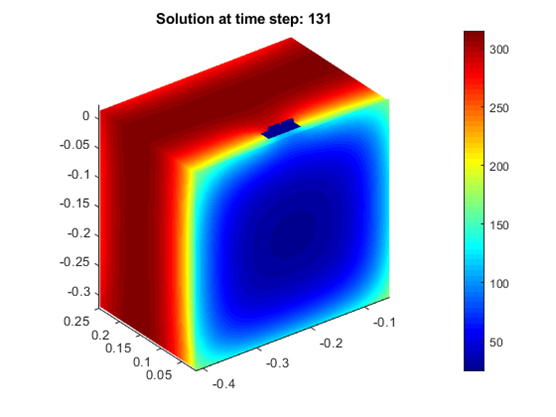

# Heat transfer during battery pack fire test modeled in Q-Bat 

### :arrow_down: Please use this link instead of the download button: [Download link](https://github.com/QuickerSim/Fire-test-Q-Bat-use-case/releases/download/1.0.0/Fire-test-Q-Bat-use-case.zip) :arrow_down:

Run fire_test_model.m and fire_test_live.mlx to get started 
* Please visit the [Q-Bat](https://www.mathworks.com/products/connections/product_detail/quickersim-q-bat.html) and [QuickerSim](https://emobility.quickersim.com/) 
page to learn more about modeling heat transfer in 3-D systems.

This repository shows how to model heat transfer in a generic battery pack during fire test in Q-Bat from QuickerSim. The model consists of 16 Li-ion cells connected in 4s4p circuit, bus bars, connectors, holders and casing and is connected to a reduced-order model (ROM) to model heat transfer in 3D geometry.

The model will simulate battery’s behavior during fire test, which consists of 3 phases:
*	70 s of direct contact with a fire source
*	60 s of indirect contact with a fire source
*	up to 3 hours of cooling to the ambient temperature

## **Simulation Model**

## **Simulation Results**

